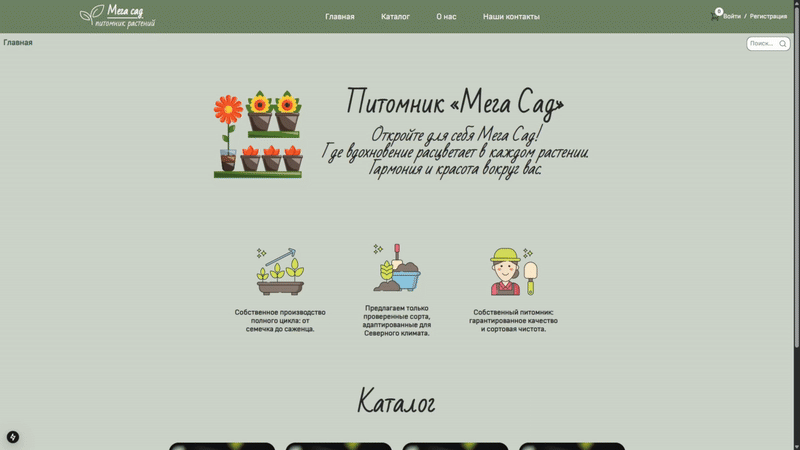
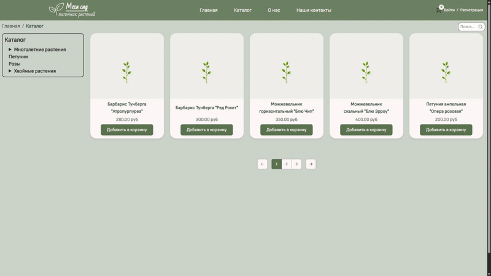
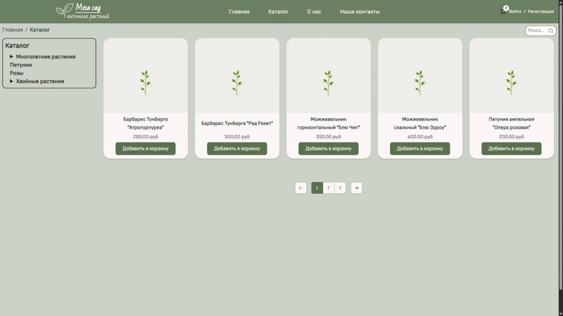
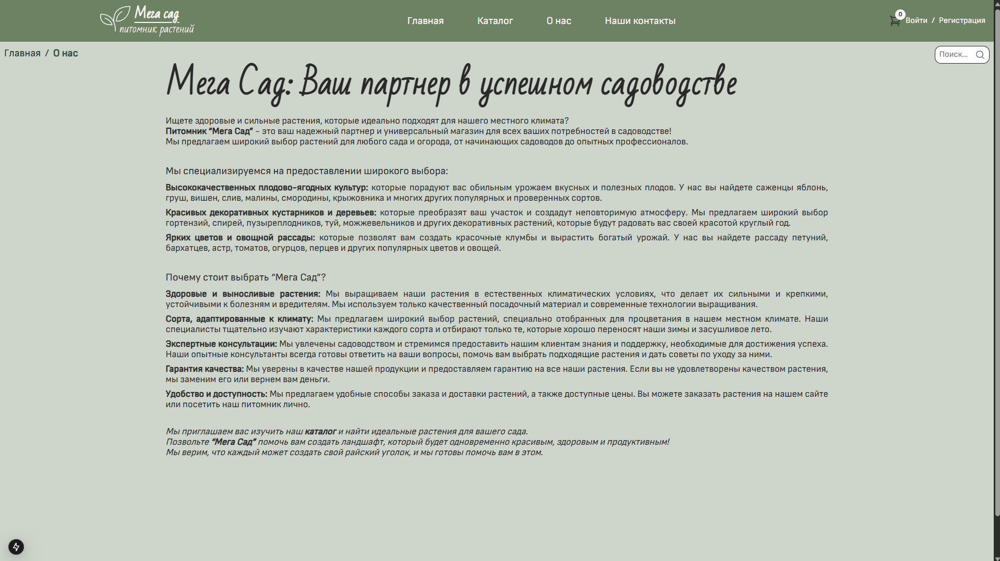
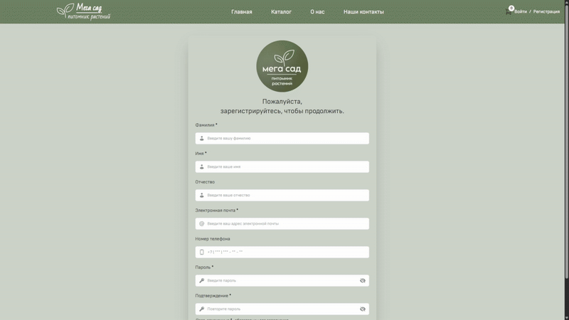
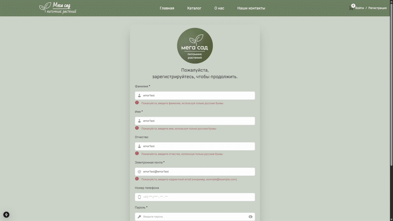
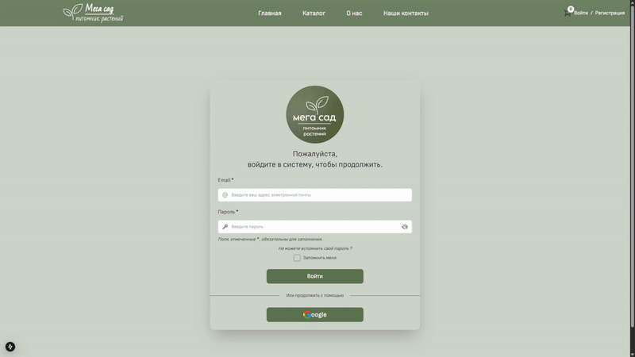
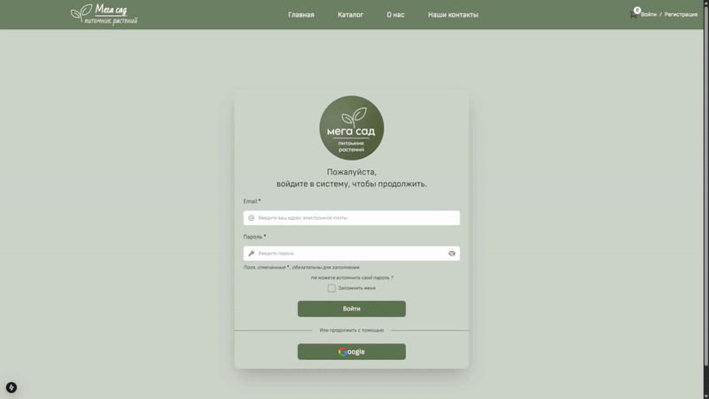
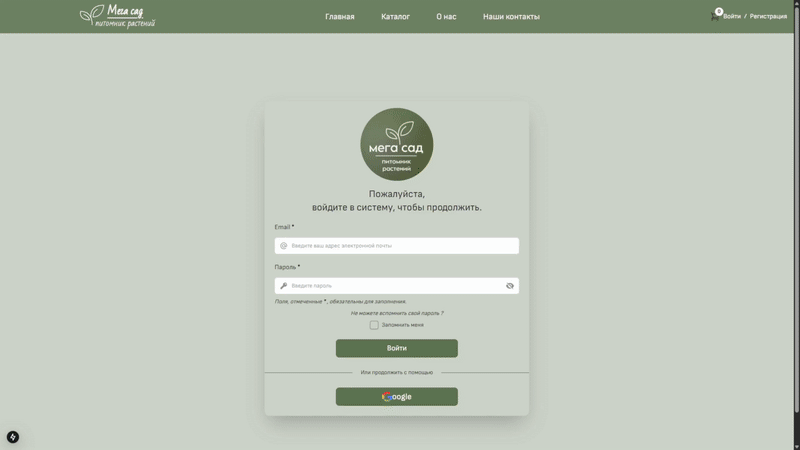

# Мега Сад | Питомник растений

Это веб-приложение для онлайн-магазина растений, находящееся в стадии активной разработки.

## На текущем этапе реализованы ключевые функции:

1. **Главная страница:** представление питомника, преимуществ и категорий каталога.
    

       
    

2. **Удобная навигация по каталогу:** просмотр товаров с пагинацией, отдельные компоненты для отображения категорий и пути по каталогу.
    

       
    

3. **Поиск растений.**
    

       
    

4. **Подробная информация о магазинах:** интерактивная карта, адреса, телефоны, email, график работы и ссылки на социальные сети.
    

       
    

5. **Страница "О нас"**: развернутая информация о компании, миссии, ценностях и ассортименте.
    

       
    

6. **Регистрация, авторизация и восстановление пароля (Auth.js, Credentials и Google провайдеры, useActionState, Zod, email уведомления).**

*   **Регистрация:**
        

           
           
        

*   **Авторизация:**
    *   Поддержка авторизации с использованием учетных данных (email и пароль).
        

           
        

    *   Поддержка авторизации через Google.
        

           
        

*   **Восстановление пароля:** Процесс восстановления забытого пароля(отправкой email-уведомлений Nodemailer).
    

       
    

7. **Серверная часть (Backend):**

Серверная часть разработана на Node.js и Express.js, спроектирована для обеспечения работы клиентского приложения Next.js и предоставляет API для управления данными и интеграции с другими системами.

## Планы дальнейшего развития

Добавление функциональности оформления заказов, расширенной системы фильтрации и сортировки товаров, подключение онлайн-оплаты, а также полноценной системы управления контентом (CMS) для администраторов, а также развертывание проекта с использованием Docker и Nginx на собственном сервере.

## Технологии

*   **Frontend:**
    *   React.js
    *   Next.js
    *   TypeScript
    *   Tailwind CSS
    *   Auth.js
    *   Zod
    *   @heroicons/react
    *   clsx
    *   ESLint
    *   Prettier
    *   Husky

*   **Backend:**
    *   Node.js
    *   Express.js
    *   PostgreSQL
    *   Sequelize
    *   bcrypt
    *   jsonwebtoken
    *   nodemailer
    *   cookie-parser
    *   morgan
    *   node-cron
    *   slugify
    *   cross-env
    *   ESLint
    *   Prettier
    *   Husky

## Ключевые особенности:

*   **Современный стек технологий:** Использование актуальных и популярных технологий для создания производительного и масштабируемого приложения.
*   **SEO-оптимизация:**  Использование Next.js для Server-Side Rendering (SSR) обеспечивает лучшую индексацию сайта поисковыми системами.
*   **Аутентификация на базе Auth.js:** Реализована надежная система аутентификации с поддержкой различных провайдеров и удобным управлением сессиями пользователей.
*   **Масштабируемость:** Архитектура приложения позволяет легко добавлять новые функции и масштабировать проект.
*   **Интеграция с Яндекс.Картами:** Наглядное отображение местоположения магазинов.
*   **Автоматическое форматирование кода:** Использование ESLint, Prettier и Husky для поддержания единого стиля кода и автоматической проверки перед коммитом.